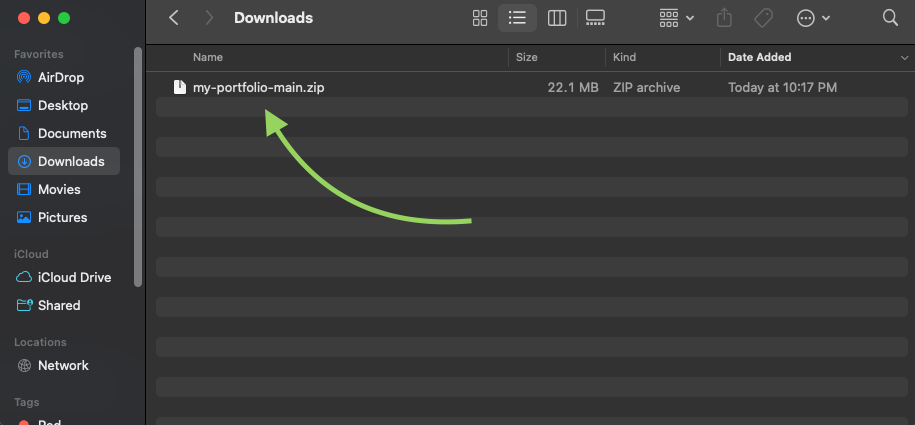
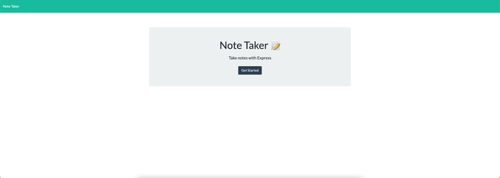
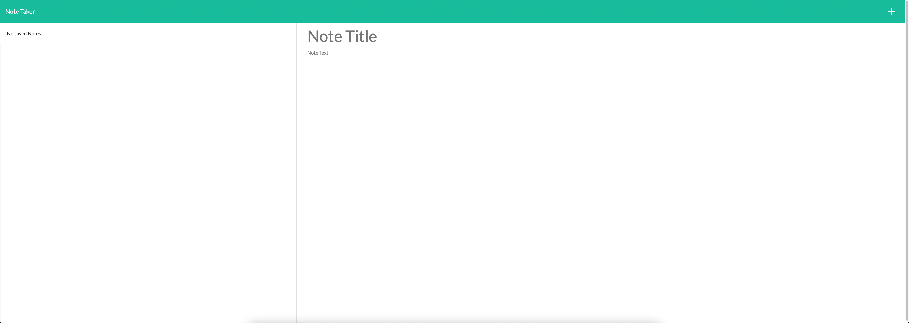
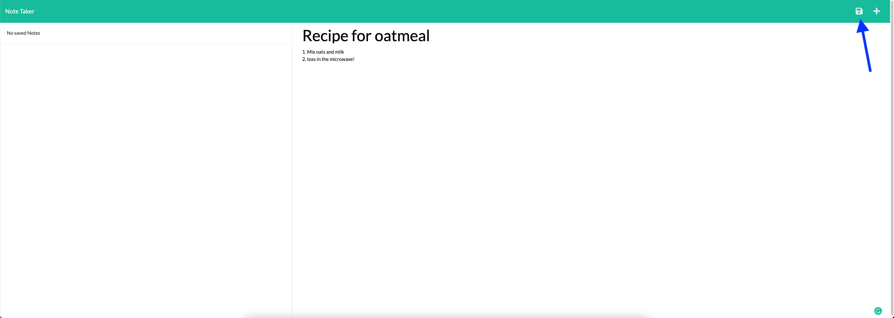
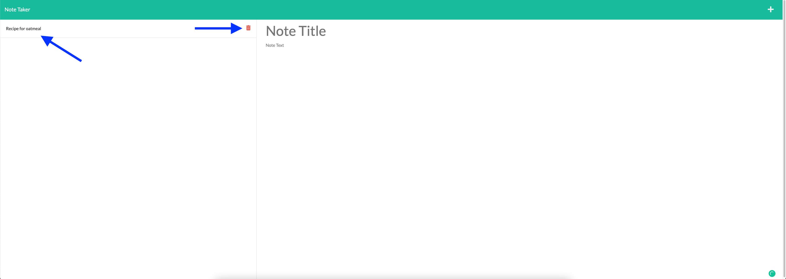

# Express Note-taker


<br>

[Deployed Application](https://note-taker-app-daliangrullon.herokuapp.com/)

<br>

## Description

I created this full-stack application to provide a fun way to take notes. Based on its current version, it does not include a way for users to store their own personal notes, so all the notes taken will be public and everyone who visits the site will be able to see and delete all notes present. I do plan on adding a login feature allowing users to save their own personal notes in the near future.

In creating this project, I learned a lot about modularizing server-side code via `routes` and `helpers`, which are both directories I created in this repository that contain script files to aid in routing and providing helper functions respectively. I also learned how to `read`, `write`, and `append` dynamically derrived data from the front-end to the file located in the `db` directory (which emulates a database) by using node's `fs` core module.

<br>

## Table of Contents

- [Installation](#installation)
- [Usage](#usage)
- [Technology](#technology)
- [Credits](#credits)
- [License](#license)

<br>

## Installation




Once unzipped, enter the integrated terminal on the root level of the project and run the following commands.

```
npm install

npm start
```

<br>

## Usage
This application allows users to take notes, save them, re-view them, and delete them! It is important to keep in mind that notes are public, so anyone who visits the link will have full control over any live notes you or anyone else may have submitted.

<br>

In launching the application, you will be greeted with the name of the application and a button to `get started`.


After clicking `get started`, you will be brought to the notes page. All previously saved notes will appear in the left-hand side. On the right hand side, you will be given the space to enter a new note tile and description.


After entering a note title, if you begin typing in a description a save button will appear in the top right corner of the screen allowing you to save your note once finished.


Once you've saved your note, it will populate on the left-hand side for reference and will remain there until deleted. You can view the note in detail by clicking the note. You can also delete the note by pressing the red trashcan icon.


<br>

## Technology
Listed below is all of the technology I used for this project:
- Node.js
- Express.js
- HTML, CSS, JavaScript

<br>

## Credits 
`Copyright © 2U Education`

The contents found within the public folder (aka the front-end) were provided by my Coding Bootcamp. I created all server-side logic and functionality.

<br>

## License

    Copyright © 2022 Dalian Grullon

    Permission to use, copy, modify, and/or distribute this software for any purpose with or without fee is hereby granted, provided that the above copyright notice and this permission notice appear in all copies.

    THE SOFTWARE IS PROVIDED "AS IS" AND THE AUTHOR DISCLAIMS ALL WARRANTIES WITH REGARD TO THIS SOFTWARE INCLUDING ALL IMPLIED WARRANTIES OF MERCHANTABILITY AND FITNESS. IN NO EVENT SHALL THE AUTHOR BE LIABLE FOR ANY SPECIAL, DIRECT, INDIRECT, OR CONSEQUENTIAL DAMAGES OR ANY DAMAGES WHATSOEVER RESULTING FROM LOSS OF USE, DATA OR PROFITS, WHETHER IN AN ACTION OF CONTRACT, NEGLIGENCE OR OTHER TORTIOUS ACTION, ARISING OUT OF OR IN CONNECTION WITH THE USE OR PERFORMANCE OF THIS SOFTWARE.
